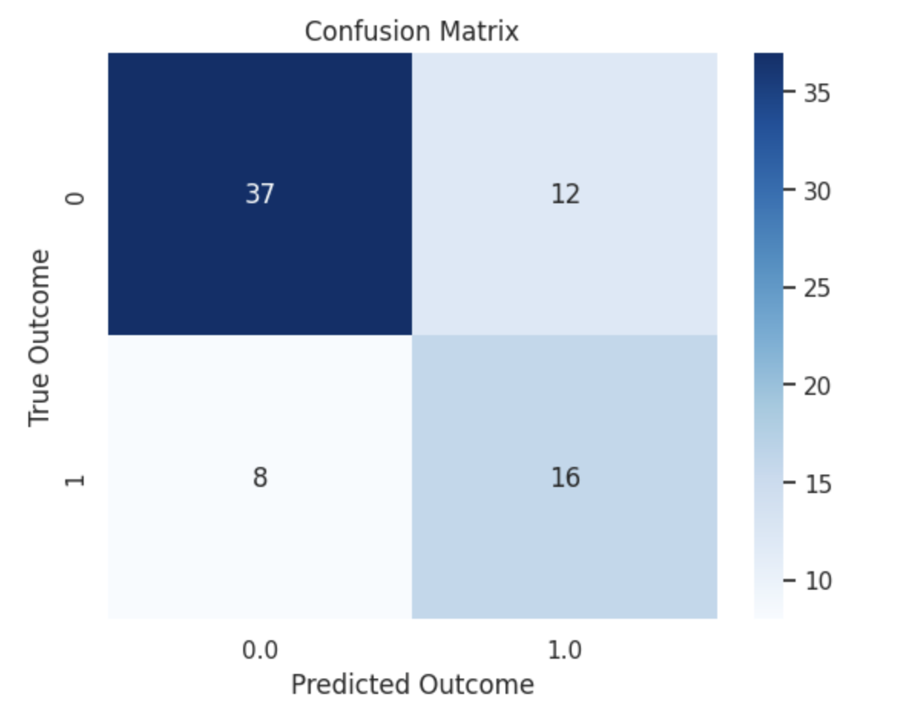

# Type-2-Diabetes-Risk-Prediction-Model
 
**Introduction:**
Developing a genetic risk score model to predict Type 2 Diabetes onset using demographic and medical data from the Pima Indian population. Aim to identify high-risk individuals for early intervention.

**Dataset Explanation:**
Utilized the NIDDK dataset from the Diabetes Prevention Program, containing medical and lifestyle data of over 3,000 participants, focusing on features like pregnancies, glucose levels, BMI, and more.

**Methodology & Implementation:**
Processed data with Pandas, imputed missing values using KNN, removed outliers, and visualized data relationships. Utilized Spark ML for model training with Decision Tree Classifier.

**Metric Evaluation & Results:**
Achieved 73% accuracy with Decision Tree Classifier, demonstrating promising precision, recall, and F1 score. Confusion matrix and classification report validate model effectiveness.

**Conclusion:**
Successfully analyzed and predicted diabetes outcomes, emphasizing the importance of early intervention. Further enhancements include exploring other ML algorithms and tuning hyperparameters for improved performance.